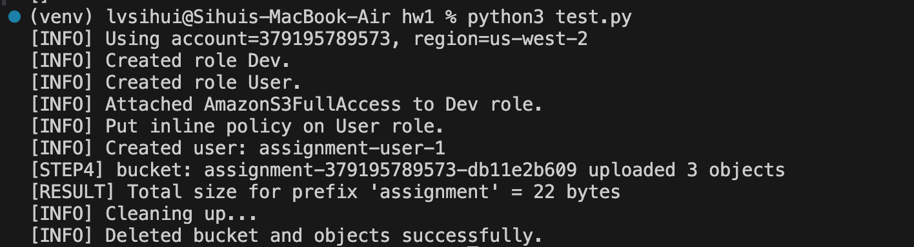
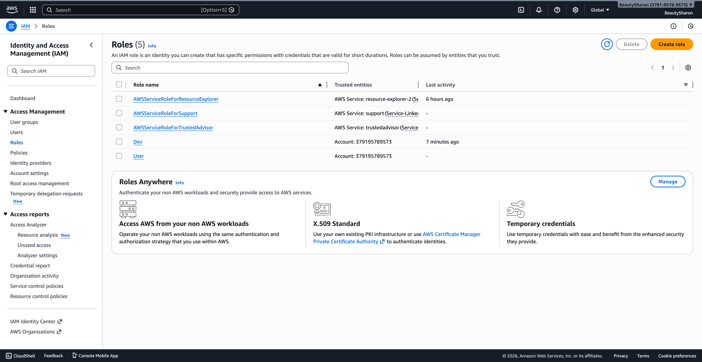
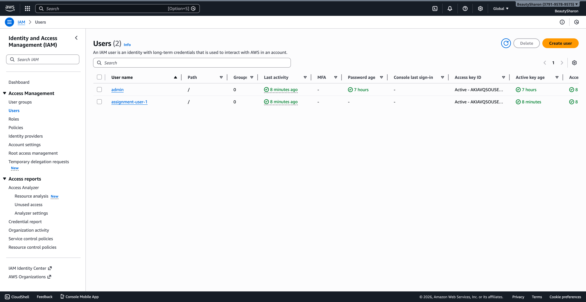
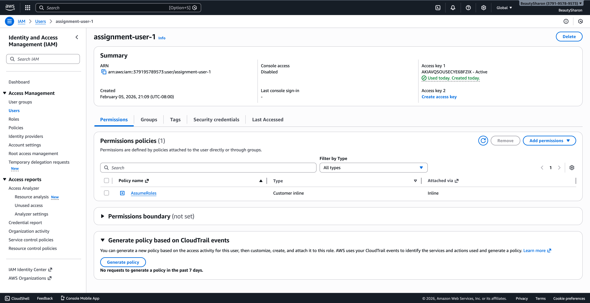
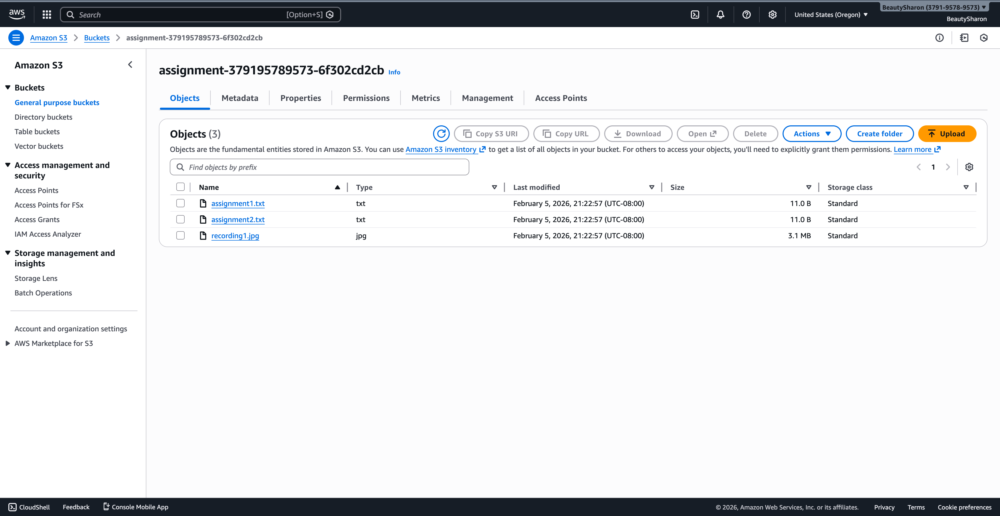

# CS6620 HW1 – AWS IAM & S3 using boto3

## Overview

This project demonstrates how to use the AWS Python SDK (**boto3**) to programmatically create IAM roles, attach policies, assume roles via AWS STS, perform S3 operations, and securely clean up cloud resources.

The entire workflow is automated through Python scripts without manual interaction in the AWS Console.

---

## Tasks Performed

The script automatically completes the following steps:

1. **Creates two IAM roles**
   - `Dev`
   - `User`

2. **Attaches policies**
   - **Dev** → AmazonS3FullAccess
   - **User** → Read-only access (List/Get)

3. **Creates an IAM user**
   Grants permission to assume both roles using STS.

4. **Assumes the Dev role to:**
   - Create a uniquely named S3 bucket
   - Upload:
     - `assignment1.txt`
     - `assignment2.txt`
     - `recording1.jpg`

5. **Assumes the User role to:**
   - Retrieve objects with prefix `assignment`
   - Compute the total object size

6. **Assumes the Dev role again to:**
   - Delete all uploaded objects
   - Delete the S3 bucket

---

## Project Structure

```
HW1/
│
├── screenshots/
│   ├── terminal.png
│   ├── IAM-Roles.png
│   ├── user.png
│   ├── permission.png
│   └── S3.png
│
├── assignment.py
├── cleanup.py
├── assignment1.txt
├── assignment2.txt
├── recording1.jpg
├── requirements.txt
├── README.md
└── .gitignore
```

---

## Screenshots

### Terminal Execution



### IAM Roles



### IAM User & Permissions




### S3 Bucket and Uploaded Objects



---

## How to Run

### 1. Install Dependencies

```bash
pip install boto3
```

---

### 2. Configure AWS Credentials

```bash
aws configure
```

Make sure your configured profile has permission to create IAM roles and S3 resources.

---

### 3. Run the Assignment Script

```bash
python3 assignment.py
```

---

### 4. (Optional) Clean Up IAM Resources

```bash
python3 cleanup.py
```

---
