# CS6650 HW2 – Use Lambda to Count Total Object Size

# Part 1 – Infrastructure Setup (Local Python Program)

A local Python script was implemented to create the required AWS resources:

- The S3 bucket (`TestBucket`)
- The DynamoDB table (`S3-object-size-history`)

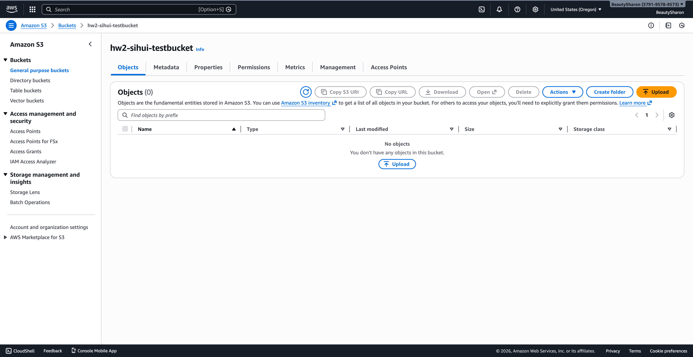
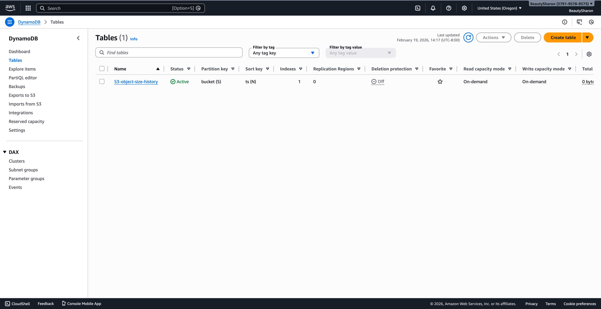

## DynamoDB Schema Design

Primary key:

- **PK:** `bucket` (string)
- **SK:** `ts` (timestamp in epoch ms)

Attributes:

- `total_size`
- `object_count`
- `max_key` (constant value `"GLOBAL"` for GSI usage)

## Global Secondary Index

To support efficient retrieval of the global maximum bucket size:

- **GSI name:** `GSI_GLOBAL_MAX`
- **PK:** `max_key`
- **SK:** `total_size`

---

# Part 2 – Size-Tracking Lambda

## Edit Code

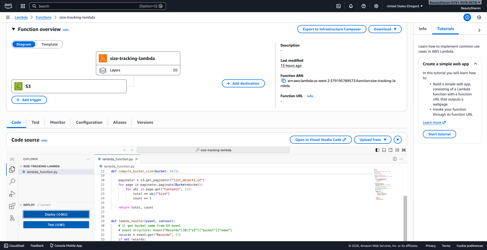

## Add Trigger

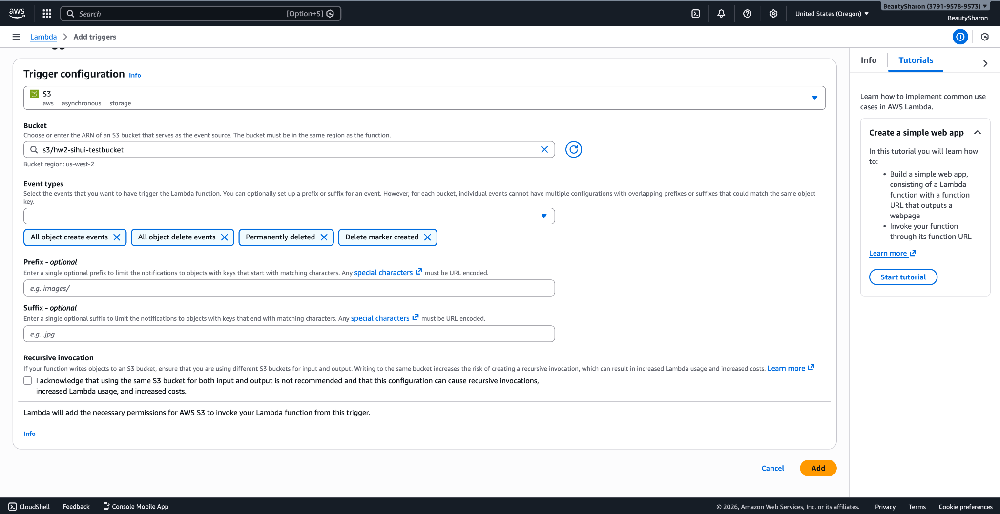

The Lambda function is triggered by S3 events:

- ObjectCreated
- ObjectRemoved

## DynamoDB Test Example

1. Upload a `test.txt` file to S3

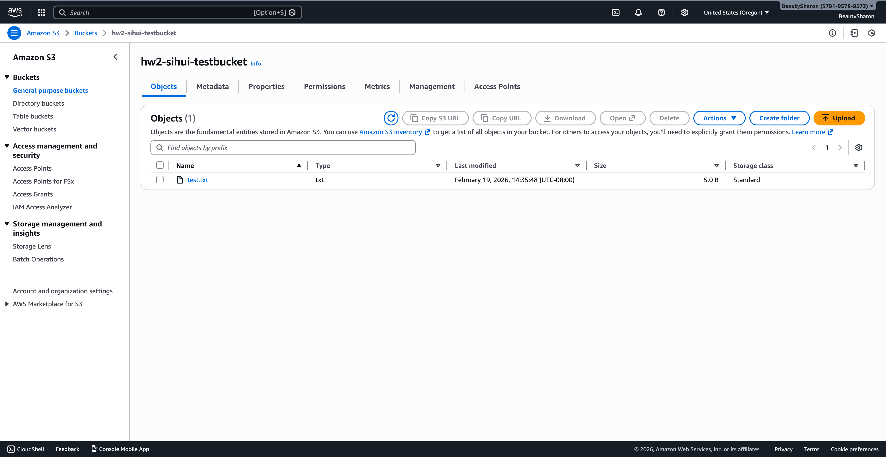

2. The DynamoDB table shows the updated record

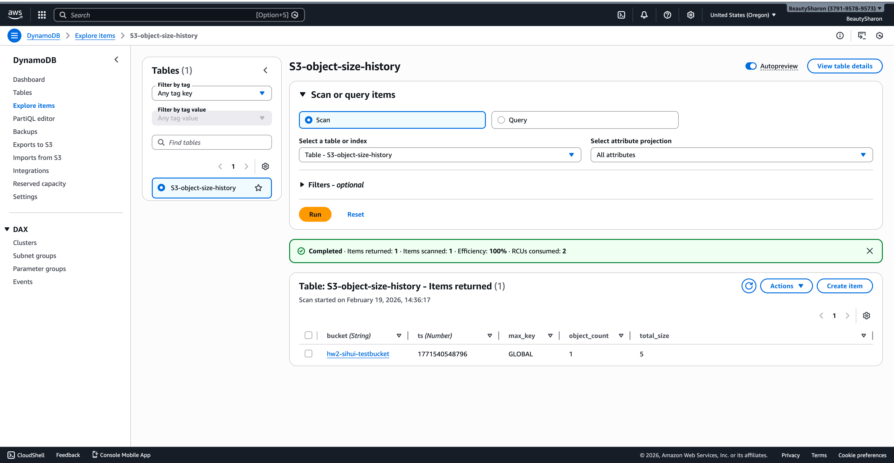

---

# Part 3 – Plotting Lambda

## Edit Code

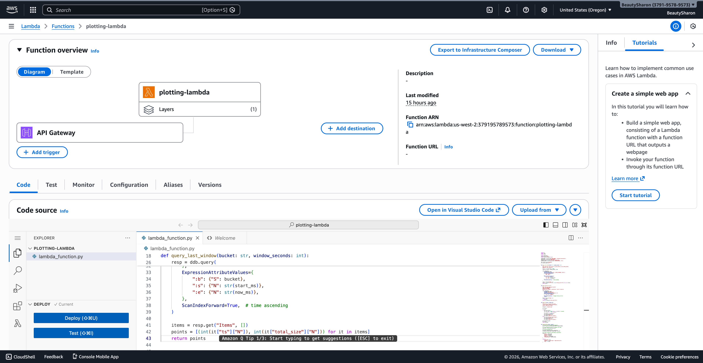

## Add Plot Layer

A plotting dependency layer was attached to support visualization generation.

## Test

1. Invoke the API URL

   https://4u3fbx893b.execute-api.us-west-2.amazonaws.com/prod/plot

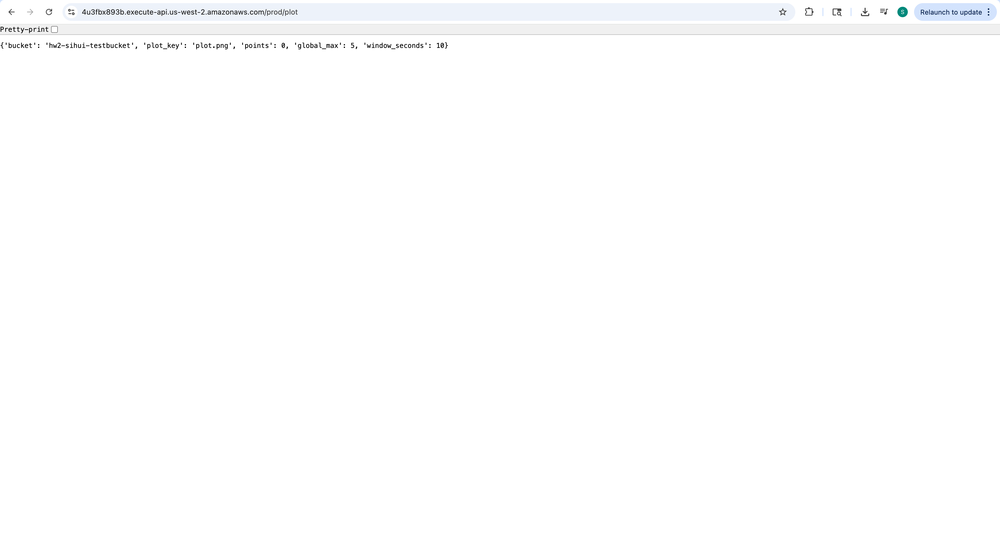

2. A plot file is uploaded to S3

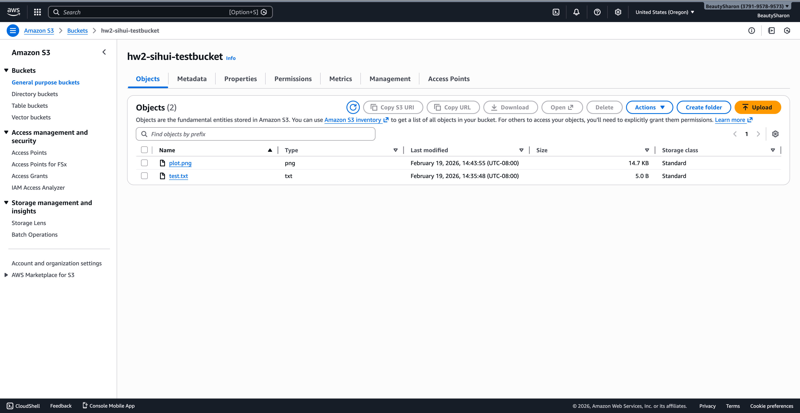

3. Generated plot file

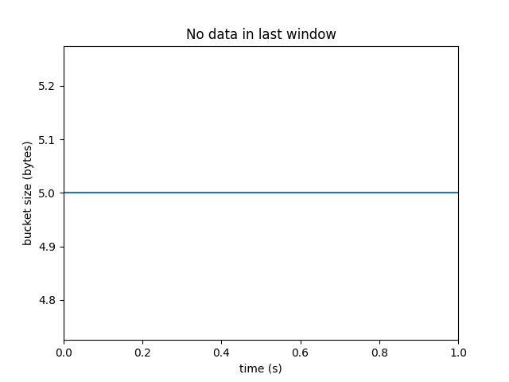

---

# Part 4 – Driver Lambda

## Edit Code

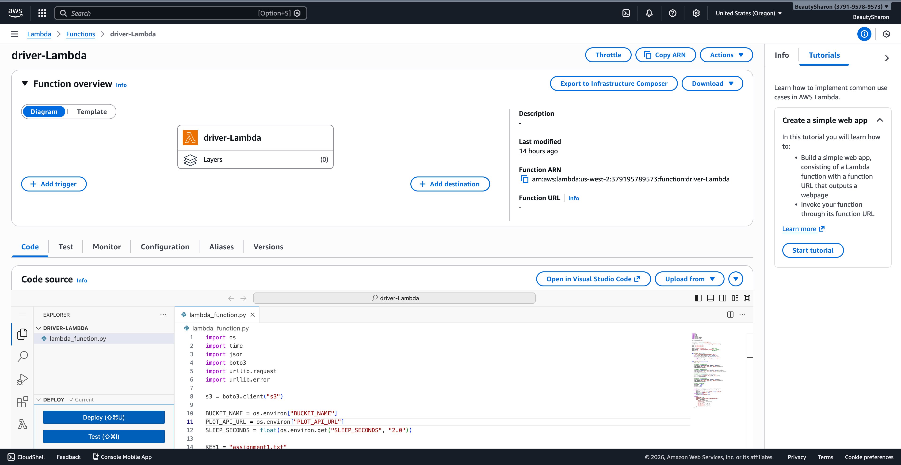

## Test

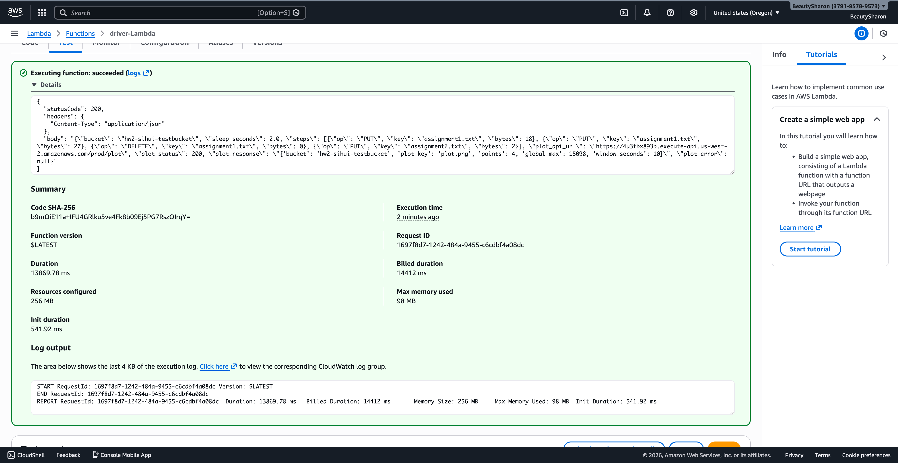
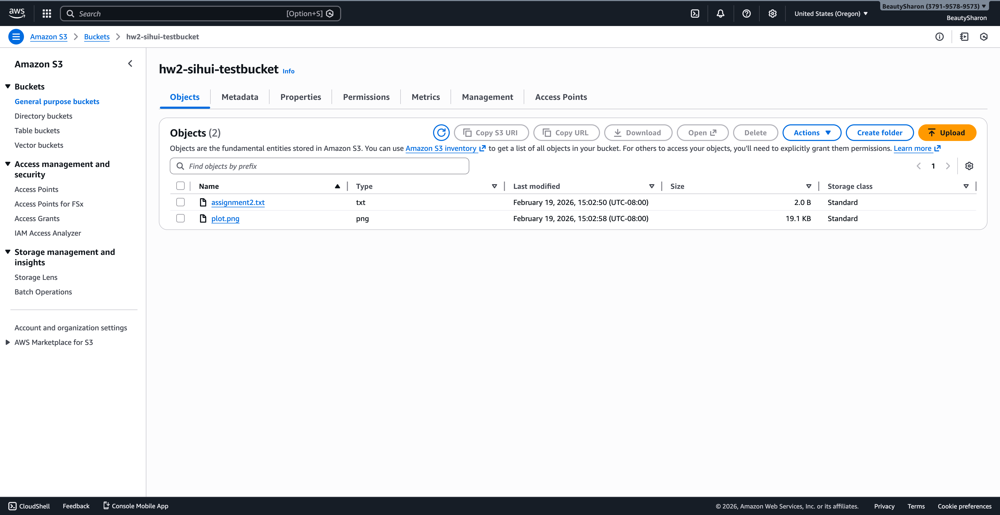
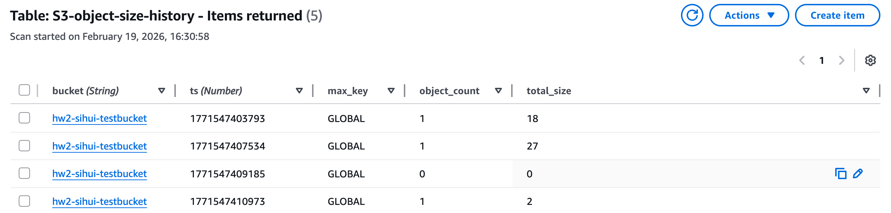
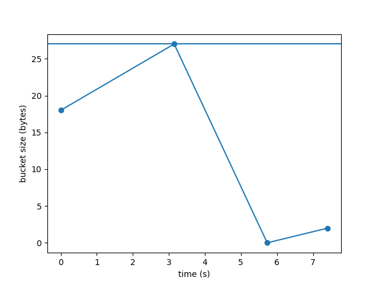
